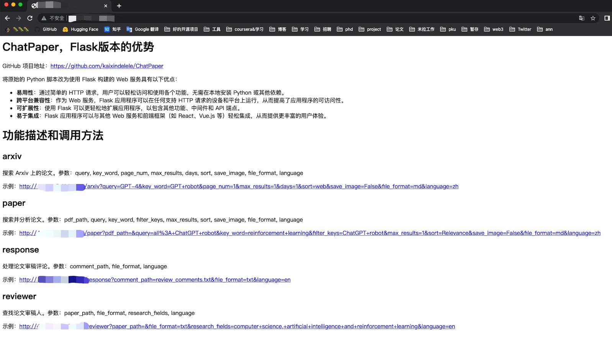

<div style="font-size: 1.5rem;">
  <a href="./README.md">中文</a> |
  <a href="./readme_en.md">English</a>
</div>
</br>

💥💥💥<strong>7K星了，发布一个猫娘版提示词，希望大家一起让猫娘活起来~：[chat_arxiv_maomao.py](https://github.com/kaixindelele/ChatPaper/blob/main/chat_arxiv_maomao.py) </strong>

<details><summary><code>猫娘版总结</code></summary>
  <div style="text-align: center;">
  
</div>
  
</details>


🌿🌿🌿<strong>使用卡顿？请Fork到自己的Space，轻松使用：<a href="https://huggingface.co/spaces/wangrongsheng/ChatPaper?duplicate=true"></a></strong>

💥💥💥<strong>面向全球，服务万千科研人的ChatPaper**免费网页版正式上线：**[https://chatpaper.org/](https://chatpaper.org/) </strong>

💥💥💥<strong>荣胜同学今天发布了一个非常有意思的工作[ChatGenTitle](https://github.com/WangRongsheng/ChatGenTitle)，提供摘要生成标题，基于220wArXiv论文的数据微调的结果！ </strong>

<h1 align="center">ChatPaper</h1>
<div align="center">
  <a href="https://github.com/kaixindelele/ChatPaper">
    
  </a>

  <p align="center">
    <h3>Refine Your Writing, Elevate Your Ideas with ChatPaper</h3>
      <a href="https://github.com/kaixindelele/ChatPaper/graphs/contributors">
        
      </a>
      <a href="https://github.com/kaixindelele/ChatPaper/issues">
        
      </a>
      <a href="https://github.com/kaixindelele/ChatPaper/pulls">
        
      <a href="https://github.com/kaixindelele/ChatPaper/stargazers">
        
      </a>
      <br/>
      <em>一站式服务 / 简单 / 快速 / 高效 </em>
      <br/>
      <a href="https://www.bilibili.com/video/BV1EM411x7Tr/"><strong>视频教程</strong></a>
        ·
      <a href="https://chatpaper.org/"><strong>在线体验</strong></a>
    </p>

  </p>
</div>

<h1 align="center">ChatPaper全流程加速科研：论文阅读+润色+审稿+审稿回复</h1>

|工具名称|工具作用|是否在线？|在线预览|备注|
|:-|:-|:-|:-|:-|
|ChatPaper|通过ChatGPT实现对**论文进行总结，帮助科研人进行论文初筛**|访问[wangrongsheng/ChatPaper](https://chatpaper.org/) 使用||[原项目地址](https://github.com/kaixindelele/ChatPaper)|
|ChatReviewer|利用ChatGPT对论文进行**预审稿**|访问[ShiwenNi/ChatReviewer](https://huggingface.co/spaces/ShiwenNi/ChatReviewer) 使用||[原项目地址](https://github.com/nishiwen1214/ChatReviewer)|
|ChatImprovement|利用ChatGPT对**论文初稿进行润色、翻译等**|访问[wangrongsheng/ChatImprovement](https://huggingface.co/spaces/wangrongsheng/ChatImprovement) 使用||[原项目地址](https://github.com/binary-husky/chatgpt_academic)|
|ChatResponse|利用ChatGPT对**审稿人的提问进行回复**|访问[ShiwenNi/ChatResponse](https://huggingface.co/spaces/ShiwenNi/ChatResponse) 使用||[原项目地址](https://github.com/nishiwen1214/ChatReviewer)|

> **所有功能免费，代码开源，大家放心使用！** 关于API如何获取，首先你得有一个没有被封的ChatGPT账号，然后[获取Api Key](https://chatgpt.cn.obiscr.com/blog/posts/2023/How-to-get-api-key/) ,填入即可！


- [💥最新讯息](#最新讯息)
- [💫开发动机](#开发动机)
- [⛏️使用步骤](#使用步骤)
- [👷‍♂️在线部署](#在线部署)
- [📄解析示例](#解析示例)
- [👁️‍🗨️使用技巧](#使用技巧)
- [🛠️常见报错](#常见报错)
- [💐项目致谢](#项目致谢)
- [🌟赞助我们](#赞助我们)
- [🌈Starchart](#Starchart)
- [🏆Contributors](#Contributors)


## 最新讯息
- 🌟*2023.03.31*: 目前已经离线总结了3w+的CCF-A会议论文了，以后大家可以不用等那么久了！
- 🌟*2023.03.23*: chat_arxiv.py可以从arxiv网站，根据关键词，最近几天，几篇论文，直接爬取最新的领域论文了！解决了之前arxiv包的搜索不准确问题！
- 🌟*2023.03.23*: ChatPaper终于成为完成体了！现在已经有论文总结+论文润色+论文审稿+论文审稿回复等功能了！
虽然我们上线了这个功能，但是大家用于审稿的时候，一定要注意学术伦理！千万别用它真的做审稿使用！

**增加了ChatReviewer（模拟顶会审稿人，自动评审论文，⭐️千万别复制粘贴直接使用！一定要注意审稿伦理和责任！该功能仅供大家作为参考！）和ChatResponse（自动提取审稿人的问题并一对一生成回复），该部分的代码均来自于[nishiwen1214](https://github.com/nishiwen1214)的[ChatReviewer](https://github.com/nishiwen1214/ChatReviewer)项目。** 使用技巧请参考这位大佬的项目！

## 开发动机

面对每天海量的arxiv论文，以及AI极速的进化，我们人类必须也要一起进化才能不被淘汰。

作为中科大强化学习方向的博士生，我深感焦虑，现在AI的进化速度，我开脑洞都赶不上。

因此我开发了这款ChatPaper，尝试用魔法打败魔法。

ChatPaper是一款论文总结工具。AI用一分钟总结论文，用户用一分钟阅读AI总结的论文。

它可以根据用户输入的关键词，自动在arxiv上下载最新的论文，再利用ChatGPT3.5的API接口强大的总结能力，将论文总结为固定的格式，以最少的文本，最低的阅读门槛，为大家提供最大信息量，以决定该精读哪些文章。

也可以提供本地的PDF文档地址，直接处理。

一般一个晚上就可以速通一个小领域的最新文章。我自己测试了两天了。

祝大家在这个极速变化的时代中，能够和AI一起进化！

这段代码虽然不多，但整个流程走通也花了我近一周的时间，今天分享给大家。

不知道能不能用这个工具，实现我小时候的梦想-- 如果每个中国人给我一块钱，那我就发财了 哈哈~

言归正传，不强制付费，但是真的希望每个觉得能帮你节省时间的研究生，在花几块钱买API的同时，能够给我一块钱奖励，非常感谢！

您的支持，是我持续更新的动力！如果有大佬愿意多支持，也是非常欢迎的！

欢迎大家加入光荣的进化！

## 使用步骤

### 一、以脚本方式运行

Windows, Mac和Linux系统应该都可以

python版本最好是3.9，其他版本应该也没啥问题

1. 在apikey.ini中填入你的openai key。注意，这个代码纯本地项目，你的key很安全！如果不被OpenAI封的话~
小白用户比较多，我直接给截图示意下可能会更好：
<div style="text-align: center;">
  
</div>

2. 使用过程要保证全局代理！
如果客户端时clash的话，可以参考这个进行配置:

<div style="text-align: center;">
  
</div>

3. 安装依赖：最好翻墙，或者用国内源。
``` bash
pip install -r requirements.txt
```

4.1. Arxiv在线批量搜索+下载+总结： 运行chat_paper.py， 比如：
```python
python chat_paper.py --query "chatgpt robot" --filter_keys "chatgpt robot" --max_results 3
```

更准确的脚本是chat_arxiv.py，使用方案，命令行更加简洁：
```python
python chat_arxiv.py --query "chatgpt robot" --page_num 2 --max_results 3 --days 2
```

其中query仍然是关键词，page_num是搜索的页面，每页和官网一样，最大是50篇，max_results是最终总结前N篇的文章，days是选最近几天的论文，严格筛选！


**注意：搜索词无法识别`-`，只能识别空格！所以原标题的连字符最好不要用！** 感谢网友提供的信息

4.2. Arxiv在线批量搜索+下载+总结+高级搜索： 运行chat_paper.py， 比如：
```python
python chat_paper.py --query "all: reinforcement learning robot 2023" --filter_keys "reinforcement robot" --max_results 3
```

4.3. Arxiv在线批量搜索+下载+总结+高级搜索+指定作者： 运行chat_paper.py， 比如：
```python
python chat_paper.py --query "ti: Sergey Levine" --filter_keys "reinforcement robot" --max_results 3
```

4.4. 本地pdf总结： 运行chat_paper.py， 比如：
```python
python chat_paper.py --pdf_path "demo.pdf"
```

4.5. 本地文件夹批量总结： 运行chat_paper.py， 比如：
```python
python chat_paper.py --pdf_path "your_absolute_path"
```

另外注意，目前这个不支持**综述类**文章。

B站讲解视频：[我把ChatPaper开源了！AI速读PDF论文和速通Arxiv论文](https://www.bilibili.com/video/BV1EM411x7Tr/)

**注意：key_word不重要，但是filter_keys非常重要！**
一定要修改成你的关键词。

另外关于arxiv的搜索关键词可以参考下图：
<div style="text-align: center;">
  
</div>

5. 参数介绍：
```
[--pdf_path 是否直接读取本地的pdf文档？如果不设置的话，直接从arxiv上搜索并且下载] 
[--query 向arxiv网站搜索的关键词，有一些缩写示范：all, ti(title), au(author)，一个query示例：all: ChatGPT robot] 
[--key_word 你感兴趣领域的关键词，重要性不高] 
[--filter_keys 你需要在摘要文本中搜索的关键词，必须保证每个词都出现，才算是你的目标论文] 
[--max_results 每次搜索的最大文章数，经过上面的筛选，才是你的目标论文数，chat只总结筛选后的论文] 
[--sort arxiv的排序方式，默认是相关性，也可以是时间，arxiv.SortCriterion.LastUpdatedDate 或者 arxiv.SortCriterion.Relevance， 别加引号] 
[--save_image 是否存图片，如果你没注册gitee的图床的话，默认为false] 
[--file_format 文件保存格式，默认是markdown的md格式，也可以是txt] 

parser.add_argument("--pdf_path", type=str, default='', help="if none, the bot will download from arxiv with query")
parser.add_argument("--query", type=str, default='all: ChatGPT robot', help="the query string, ti: xx, au: xx, all: xx,")    
parser.add_argument("--key_word", type=str, default='reinforcement learning', help="the key word of user research fields")
parser.add_argument("--filter_keys", type=str, default='ChatGPT robot', help="the filter key words, 摘要中每个单词都得有，才会被筛选为目标论文")
parser.add_argument("--max_results", type=int, default=1, help="the maximum number of results")
parser.add_argument("--sort", default=arxiv.SortCriterion.Relevance, help="another is arxiv.SortCriterion.LastUpdatedDate")    
parser.add_argument("--save_image", default=False, help="save image? It takes a minute or two to save a picture! But pretty")
parser.add_argument("--file_format", type=str, default='md', help="导出的文件格式，如果存图片的话，最好是md，如果不是的话，txt的不会乱")
```

### 二、 以Flask服务运行

1. 下载项目并进入项目目录

```text
git clone https://github.com/kaixindelele/ChatPaper.git
cd ChatPaper
```

2. 在项目根目录下的 `apikey.ini` 文件中填入您的 OpenAI 密钥。
3. 配置虚拟环境并下载依赖

```text
pip install virtualenv 
安装虚拟环境工具
virtualenv venv 
新建一个名为venv的虚拟环境
Linux/Mac下:
source venv/bin/activate

Windows下:
.\venv\Scripts\activate.bat

pip install -r requirements.txt
```
4. 启动服务

```text
python3 app.py
# 启动 Flask 服务。运行此命令后，Flask 服务将在本地的 5000 端口上启动并等待用户请求。在浏览器中访问以下地址之一以访问 Flask 服务的主页：
# http://127.0.0.1:5000/
# 或
# http://127.0.0.1:5000/index
```

访问 http://127.0.0.1:5000/ 后，您将看到主页。在主页上，您可以点击不同的链接来调用各种服务。您可以通过修改链接中的参数值来实现不同的效果。有关参数详细信息，请参阅上一步骤中的详细介绍



+ 特别的，这四个接口实际是封装了根目录下四个脚本的 web 界面。参数可以通过链接来修改。例如要运行“arxiv?query=GPT-4&key_word=GPT+robot&page_num=1&max_results=1&days=1&sort=web&save_image=False&file_format=md&language=zh”的话，相当于在根目录下调用 chat_arxiv.py 并返回结果。这个显示的结果和在命令行中调用的结果是一样的（即：python chat_arxiv.py --query "GPT-4" --key_word "GPT robot" --page_num 1 --max_results 1 --days 1 --sort "web" --save_image False --file_format "md" --language "zh"）。您可以通过修改参数来获得其他搜索结果。

  如果以这种方式部署的话，结果会保存在同级目录下新生成的export、pdf_files 和response_file三个文件夹里

### 三、以docker形式运行

1. 安装docker和docker-compose，可以参考以下链接

   https://yeasy.gitbook.io/docker_practice/install

   https://yeasy.gitbook.io/docker_practice/compose/install

2. 找地方放项目根目录下的“docker-compose.yaml”文件，将21行的`YOUR_KEY_HERE`替换为自己的openai_key

3. 在同级目录下在命令行运行

   ```
   docker-compose up -d
   ```

4. 这样的界面代表一些正常，随后访问https://127.0.0.1:28460/ 就可以从网页上打开了! 

+ 特别的，如果有改进项目的想法，您可以查看 build.sh、dev.sh、tagpush.sh这三个脚本以及根目录docker目录下文件的作用，相信它们会对你容器化封装项目的思想有进一步提升

+ 所有的运行结果都被保存在 Docker 的 volumes 中，如果想以服务的形式长期部署，您可以将这些目录映射出来。默认情况下，它们位于 /var/lib/docker/volumes/ 下。您可以进入该目录并查看 chatpaper_log、chatpaper_export、chatpaper_pdf_files 和 chatpaper_response_file 四个相关文件夹中的结果。有关 Docker volumes 的详细解释，请参考此链接：http://docker.baoshu.red/data_management/volume.html。

  
  
  

## 在线部署

1. 在[Hugging Face](https://huggingface.co/) 创建自己的个人账号并登录；
2. 进入ChatPaper主仓库：[https://huggingface.co/spaces/wangrongsheng/ChatPaper](https://huggingface.co/spaces/wangrongsheng/ChatPaper) ，您可以在[Files and Version](https://huggingface.co/spaces/wangrongsheng/ChatPaper/tree/main) 看到所有的最新部署代码；
3. [可选]私有化部署使用：点击[Duplicate this space](https://huggingface.co/spaces/wangrongsheng/ChatPaper?duplicate=true) ，在弹出的页面中将`Visibility`选择为`Private`，最后点击`Duplicate Space`，Space的代码就会部署到你自己的Space中，为了方便自己每次调用可以不用填写API-key，您可以将[app.py#L845](https://huggingface.co/spaces/wangrongsheng/ChatPaper/blob/5335124d25b1bc4017a2f5c48b0038dfa545bf63/app.py#L845) 修改为您的密钥：`default="sk-abcdxxxxxxxx"` ，点击保存文件就会立即重新部署了；
4. [可选]公有化部署使用：点击[Duplicate this space](https://huggingface.co/spaces/wangrongsheng/ChatPaper?duplicate=true) ，在弹出的页面中将`Visibility`选择为`Public`，最后点击`Duplicate Space`，Space的代码就会部署到你自己的Space中，这样就可以完成一个公有化的部署。

> 注：公有化部署和私有化部署根据你的需求二选一即可！

## 解析示例

<details><summary><code>查看解析结果</code></summary>
<h2>Paper:1</h2>
<ol>
<li>
<p>Title: Diffusion Policy: Visuomotor Policy Learning via Action Diffusion 中文标题: 通过行为扩散的视觉运动策略学习</p>
</li>
<li>
<p>Authors: Haonan Lu, Yufeng Yuan, Daohua Xie, Kai Wang, Baoxiong Jia, Shuaijun Chen</p>
</li>
<li>
<p>Affiliation: 中南大学</p>
</li>
<li>
<p>Keywords: Diffusion Policy, Visuomotor Policy, robot learning, denoising diffusion process</p>
</li>
<li>
<p>Urls: http://arxiv.org/abs/2303.04137v1, Github: None</p>
</li>
<li>
<p>Summary:</p>
</li>
</ol>
<p>(1): 本文研究的是机器人视觉动作策略的学习。机器人视觉动作策略的学习是指根据观察到的信息输出相应的机器人运动动作，这一任务较为复杂和具有挑战性。</p>
<p>(2): 过去的方法包括使用高斯混合模型、分类表示，或者切换策略表示等不同的动作表示方式，但依然存在多峰分布、高维输出空间等挑战性问题。本文提出一种新的机器人视觉运动策略模型 - Diffusion Policy，其结合了扩散模型的表达能力，克服了传统方法的局限性，可以表达任意分布并支持高维空间。本模型通过学习代价函数的梯度，使用随机Langevin动力学算法进行迭代优化，最终输出机器人动作。</p>
<p>(3): 本文提出的机器人视觉动作策略 - Diffusion Policy，将机器人动作表示为一个条件去噪扩散过程。该模型可以克服多峰分布、高维输出空间等问题，提高了策略学习的表达能力。同时，本文通过引入展望控制、视觉诱导和时间序列扩散变换等技术，继续增强了扩散策略的性能。</p>
<p>(4): 本文的方法在11个任务上进行了测试，包括4个机器人操纵基准测试。实验结果表明，Diffusion Policy相对于现有的机器人学习方法，表现出明显的优越性和稳定性，平均性能提升了46.9%。</p>
<p></p>
<p>7.Methods:
本文提出的视觉动作策略学习方法，即Diffusion Policy，包括以下步骤：</p>
<p>(1) 建立条件去噪扩散过程：将机器人动作表示为一个含有高斯噪声的源的条件随机扩散过程。在该过程中，机器人状态作为源，即输入，通过扩散过程输出机器人的运动动作。为了将其变为条件随机扩散模型，我们加入了代价函数，它在路径积分中作为条件。</p>
<p>(2) 引入随机Langevin动力学：将学习代价函数的梯度转换为基于随机Langevin动力学的迭代优化问题。该方法可以避免显示计算扩散过程，并且可以满足无导数优化器的要求，使其受益于渐近高斯性质以及全局收敛性质。</p>
<p>(3) 引入扩散策略增强技术：使用展望控制技术，结合决策网络，对由扩散产生的动作进行调整，从而增强策略的性能。同时，引入视觉诱导以及时间序列扩散变换，来进一步提高扩散策略的表达能力。</p>
<p>(4) 在11个任务上进行测试：测试结果表明，该方法相对于现有的机器人学习方法，在机器人操纵基准测试中表现出明显的优越性和稳定性，平均性能提升了46.9%。</p>
<p>7.Conclusion: </p>
<p>(1):本文研究了机器人视觉动作策略的学习方法，提出了一种新的机器人视觉运动策略模型 - Diffusion Policy，通过引入扩散模型的表达能力，克服了传统方法的局限性，可以表达任意分布并支持高维空间。实验结果表明，该方法在11个任务上均表现出明显的优越性和稳定性，相对于现有机器人学习方法，平均性能提高了46.9%，这一研究意义巨大。</p>
<p>(2):虽然本文提出了一种新的机器人视觉动作策略学习方法，并在实验中取得了良好的表现，但该方法的优化过程可能比较耗时。此外，该方法的性能受到多种因素的影响，包括演示的质量和数量、机器人的物理能力以及策略架构等，这些因素需在实际应用场景中加以考虑。</p>
<p>(3):如果让我来推荐，我会给这篇文章打9分。该篇文章提出的Diffusion Policy方法具有较高的可解释性、性能表现良好、实验结果稳定等优点，能够为机器人视觉动作策略学习等领域带来很大的启发与借鉴。唯一的不足可能是方法的优化过程需要投入更多的时间和精力。</p>
</details>

## 使用技巧

快速刷特定关键词的论文，不插图的话，每张篇文章需要花一分钟，阅读时间差不多一分钟。

本项目可以用于跟踪领域最新论文，或者关注其他领域的论文，可以批量生成总结，最大可生成1000（如果你能等得及的话）。
虽然Chat可能有瞎编的成分，但是在我的规范化提问的框架下，它的主要信息是保熟的。

数字部分需要大家重新去原文检查！

找到好的文章之后，可以精读这篇文章。

推荐另外两个精读论文的AI辅助网站：https://typeset.io/ 和chatpdf。
我的教程： [强化学徒：论文阅读神器SciSpace(Typeset.io)测评-和AI一起进化](https://zhuanlan.zhihu.com/p/611874187)

和上面这两个工具的主要优势在于，ChatPaper可以批量自动总结最新论文，可以极大的降低阅读门槛，尤其是我们国人。
缺点也很明显，ChatPaper没有交互功能，不能连续提问，但我觉得这个重要性不大~

## 常见报错

1. pip 安装错误：


推荐关掉梯子，使用国内源下载：
```bash
pip install -r requirements.txt -i  http://pypi.douban.com/simple  --trusted-host pypi.douban.com
```

2. 调用openai的chatgpt api时出现APIConnectionError, 如何解决?
参考知乎回答：
https://www.zhihu.com/question/587322263/answer/2919916984

直接在chat_paper.py里加上

os.environ["http_proxy"] = "http://<代理ip>:<代理端口>"
os.environ["https_proxy"] = "http://<代理ip>:<代理端口>"

代理ip和端口需要你在Windows系统里面查找。
<div style="text-align: center;">
  
</div>


3. API被OpenAI禁了的报错：


这种情况只能用新号了。另外一定要注意一个号尽量不要多刷，节点一定要靠谱，千万不能用大陆和香港的节点，用了就寄。

4. Https通信错误：


这个报错大概率是节点不够干净。如果有大佬知道具体原因，欢迎挂issues

## 项目致谢

本项目三天一千star的时刻，我补一下对这个项目的促成的各位致谢！
1. 群友和实验室同学的技术支持和大量转发！还有张老板和化老板的出谋划策。
2. [Siyuan](https://github.com/HouSiyuan2001)同学在我开始项目的时候，分享了两个核心函数，节省了很多时间。
3. [rongsheng](https://github.com/WangRongsheng)同学的在线网站，让这个项目可以使得更多的技术小白，可以尝试。
4. [Arxiv](https://github.com/lukasschwab/arxiv.py)的作者提供的好用的arxiv论文下载包。
5. [PyMuPDF](https://github.com/pymupdf/PyMuPDF)提供良好的PDF解析工具。让整个信息流得以打通。
6. OpenAI一方面做出了杰出的AI，另外一方面禁了我们国家，搞得我都不知道该怎么写这行。
7. 感谢Ex-ChatGPT的作者分享的各种ChatGPT的开发细节，开发过程中学习良多，以及现在一直在开发我们的网页版内容。另外给计算机专业的佬们，推荐这款非常强大的开源工具：
8. 感谢ChatReviewer的作者将他的项目合并到我们的ChatPaper中，使得ChatPaper更加完整。
[Ex-ChatGPT](https://github.com/circlestarzero/EX-chatGPT) 是一个强大的工具平台，能让 ChatGPT 能够调用外部 API，例如 WolframAlpha、Google 和 WikiMedia，以提供更准确和及时的答案。
江湖人称 GoogleChat.
9. 还得感谢GitHub官方，帮我们这个项目列入了[热榜第五](https://github.com/trending)，获得了大量的关注！
10. 后面我们整个项目流程打通，需要感谢同样是中科院的同学们开发的[chatgpt_academic](https://github.com/binary-husky/chatgpt_academic)，我们在他们的基础上做了润色部分。以及[nishiwen1214](https://github.com/nishiwen1214)的[ChatReviewer](https://github.com/nishiwen1214/ChatReviewer)，补齐了我们的审稿和审稿回复。
11. 感谢[SilenceEagle](https://github.com/SilenceEagle/paper_downloader)提供的CCF-A的论文数据库，我们已经离线总结了3w+的论文了。

## 赞助我们

感谢您对我们ChatPaper辅助论文写作工具开发项目的关注和支持！我们的项目旨在为科研人员提供一款高效、智能的辅助工具，帮助他们更便捷地完成论文总结等工作，提升学术水平和研究成果的质量。
与此同时，我们也欢迎来自各界的赞助和支持，这将帮助我们更快地推进项目的开发和完善，并且可以使我们的工具更加符合用户需求。如果您有意向对我们的项目进行赞助，我们将不胜感激，并期待与您的合作！
再次感谢您的关注和支持，愿我们的项目能够为您和更多的科研人员带来便捷和帮助。

<div style="text-align: center;">
  
</div>

## Starchart

[](https://star-history.com/#kaixindelele/ChatPaper&Date)

## Contributors

<a href="https://github.com/kaixindelele/ChatPaper/graphs/contributors">
  
</a>
